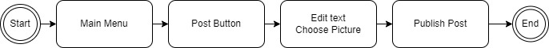

# Specification Phase Exercise

A little exercise to get started with the specification phase of the software development lifecycle. See the [instructions](instructions.md) for more detail.

## Team members

[Yiwen Yin yy3401@nyu.edu](https://github.com/YY35n)
[Michael Han zh2033@nyu.edu](https://github.com/Hmic1102)
[Jinqiao Cheng joc297](https://github.com/jinqiaocheng163)

## Stakeholders

Interview at least one person who is a good representative of the type of person for whom you are designing an app. Ask them questions about their goals, needs and desires. Find out problems and frustrations they have that a mobile app might be able to help with. You should be able to identify at least four goals/needs and four problems/frustrations.

Problem:
* When I want to cook, I cannot find out the step-by-step instructions for a beginner cooker.
* When I am on a diet, I cannot make sure the dish I am cooking fulfill personal goal of daily intake
* When I have specific question about a dish (specific scale of gradient,etc. ) I cannot reach to the publisher.
* When I want to publish or record how many dish was cooked and how they were cooked, I cannot find a right platform to share and record.

## Product Vision Statement

To revolutionize the culinary journey by creating a comprehensive, user-friendly platform that not only enriches cooking and eating experiences with a diverse array of global recipes and detailed nutritional insights but also fosters a vibrant community of food enthusiasts. By empowering users to share their culinary creations, access personalized nutrition information, and connect with like-minded individuals, we aim to make cooking a more accessible, health-conscious, and socially engaging activity for everyone, regardless of their dietary preferences or cooking skill level.
## User Requirements

* As a home cook, I want to share my unique recipes so that I can inspire others with my culinary creations.
* As a fitness enthusiast, I want to find meals with specific caloric contents so that I can maintain a healthy diet while enjoying diverse cuisines.
* As a beginner in cooking, I want to access step-by-step cooking guides so that I can learn to cook with ease and build my cooking skills.
* As a nutrition-conscious user, I want to see detailed nutritional information for each recipe so that I can make informed decisions about what I eat.
* As a busy worker, I want to find quick and easy recipes so that I can prepare meals efficiently without sacrificing quality.
* As a food lover, I want to explore recipes from different cultures so that I can enjoy a variety of flavors and expand my culinary horizons.
* As a parent, I want to find family-friendly recipes so that I can prepare meals that are both nutritious and appealing to children.
* As a vegetarian, I want to filter recipes by dietary preference so that I can easily find meals that align with my lifestyle.
* As a recipe creator, I want to receive feedback and ratings on my recipes so that I can improve my cooking and presentation skills.
* As a food-content creator, I want to post my recipes on social media so that I can manage the account and make money.

## Activity Diagrams

See instructions. Delete this line and place images of your UML Activity diagrams here.

## Clickable Prototype

See instructions. Delete this line and place a publicly-accessible link to your clickable prototype here.
